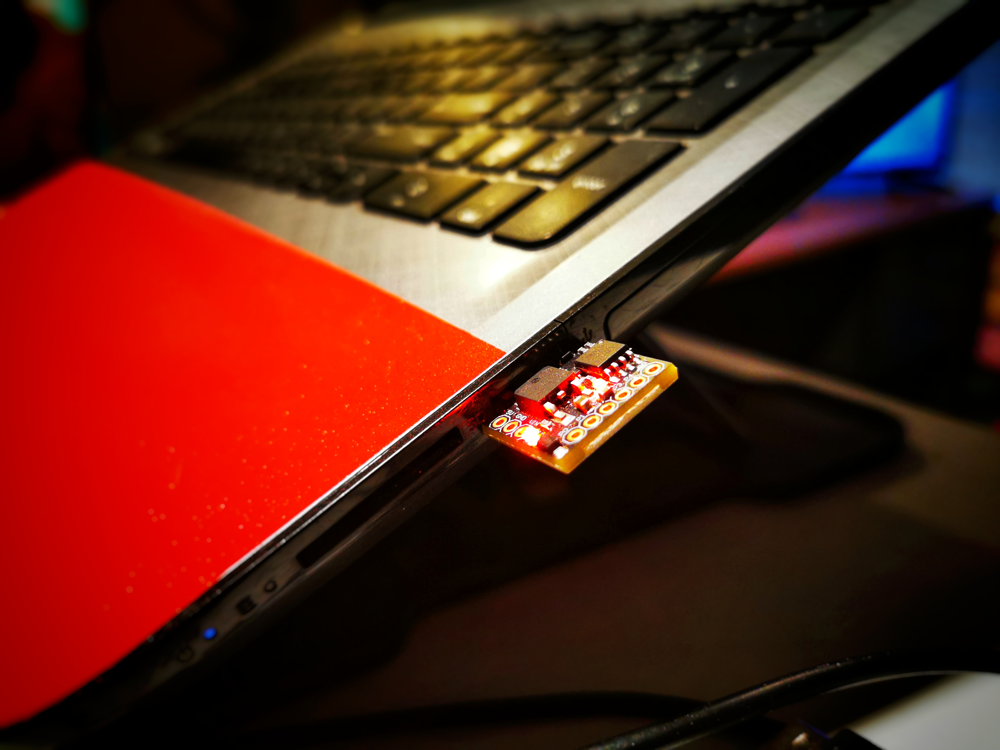

# Rubber DigiKey
DigiSpark ATTiny85 Rubber Ducky Collection,


• Modified "DigiKeyboard.h" for more key support and easier writing.   
(changed to Keyboard instead of DigiKeyboard namespace for experienced users with Arduino )     
   
• Modified Bootloader with Jumper Pin for Programming    
> You can install a modified bootloader which will not wait 5 seconds before executing the users code - the digispark waits 5 seconds for the computer to send an update to the program, if the program isn't updated in 5 seconds then it proceeds with the user scripts.   
- Added as Quick Launch Payloads   
  

Example, 
```
#include <DigiKeyboard.h>     
void loop(){
// OLD WAY
DigiKeyboard.keyPress();

// NEW WAY
Keyboard.keyPress();

}
```

• Example GitHub Payload & Script for Delivery.
   
  
 
#### Notes.     
   
        

> • The DigiSpark ATTiny85 has limited memory and therefore the best way to implement a large payload is by retrieving the script from the internet during the attack, bypassing the limitation of memory ( around 40 lines in Arduino IDE ) however introducing a new limitation of needing internet access in powershell on the victim machine.    
     
> • The included payload is benign, however the GitHub Dropper file is a great example of using a classic Task Manager UAC Bypass to gain Admin privileges in powershell, after privilege escalation to powershell, the script will fetch the payload from GitHub "hence the name GitHub Dropper" - the speedy.ps1 powershell script will kill task manager and continue to the previous shell instance where the PSReadLine history will be erased and then exit.
 
( PSReadLine History is erased to remove the history of commands entered in powershell, after the script has been fetched and executed from GitHub, - this requires that the script doesn't call an exit, just allows the previous command to continue and erase the PSReadLine user history. ).     
Alternatively, you can disable the module leaving only small trace's in the PSReadLine History with `Remove-Module psreadline` and `Import-Module psreadline` along with cls command, Clear-History command and ALT+F7 to clear instance history.
  
  
   
    

#### PSReadLine Removal Command Used ( Cleanup Traces ).   
`Remove-Item -Path \"$env:userprofile\AppData\Roaming\Microsoft\Windows\PowerShell\PSReadline\ConsoleHost_history.txt\"`      
> I would also suggest adding some more cleanup to the temporary script execution directory.    

    


  
  
   
